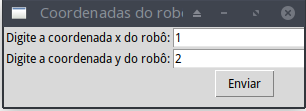
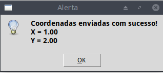
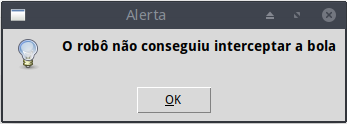
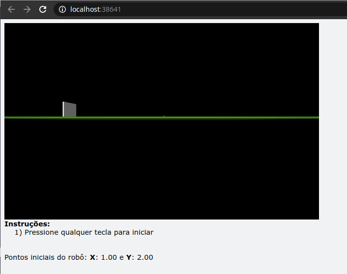
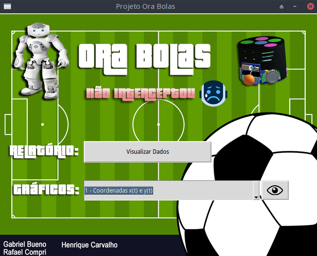

# robot-soccer

This repository is a simulation of a robot playing soccer.

## Description
The objective of this project is simulate a robot trying to kick a ball to the goal of the fatest way, the ball trajectory is discribed by the [file](trajetoria.txt), the initial position of the robot is configurated by the user, after this will be show a 3d simulation and the results and graphs of the simulation.

## How to run
 In order to run the project, run the following command: 

 ```sh
 python3 main.py
 ```

 1. Enter with the robot initial position values


    

    * if the coordinates are valid will be displayed a window of success to set coordinates

    

2. **After click in Ok, will be displayed a window saying if the robot reach the ball or not**
 
    

3. Will be open a window in your default browser with the 3d simulation of the robot trying to reach the ball.
    **Press any key to start the simulation**
 
    

4. **Simulation**

    


5. **Report with graph**

    


